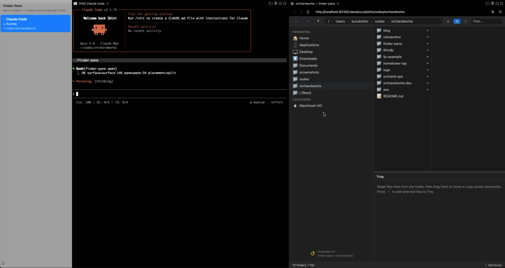
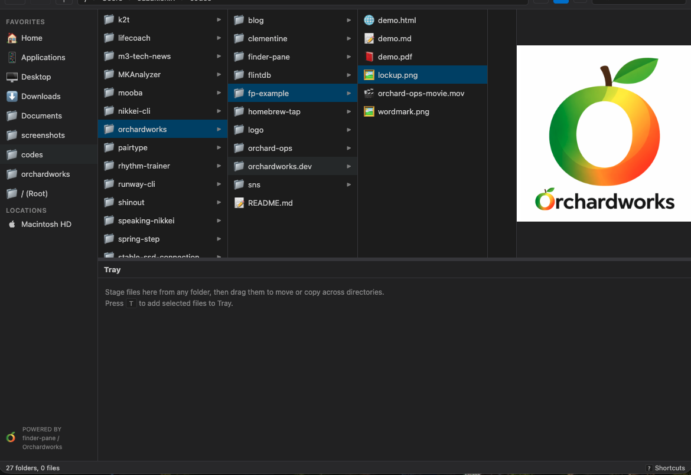
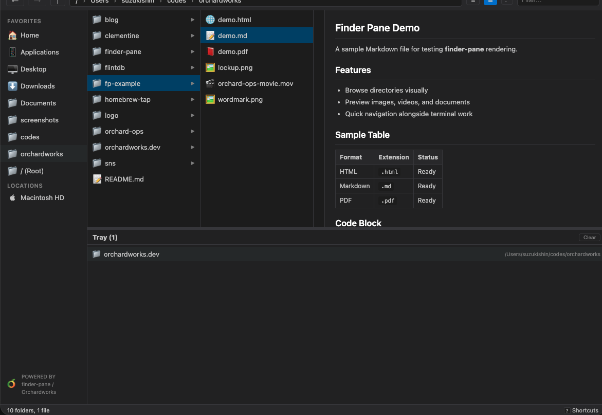
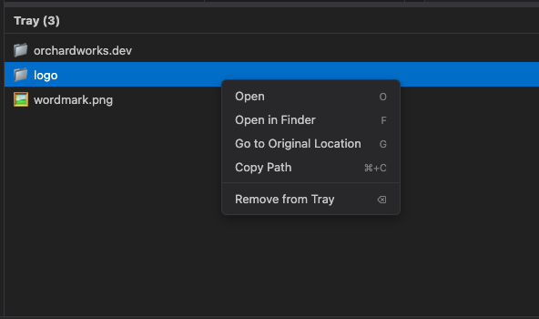

# finder-pane

A visual file browser for your terminal.
Browse files, preview images and videos right next to Claude Code.

  

```sh
brew install orchardworks/tap/finder-pane
```



## Features

### Browse files while you code

finder-pane runs in a browser pane next to Claude Code via [cmux](https://cmux.dev).
See your directory structure, navigate folders, and check what's there — without switching windows.

### Preview files instantly

Click a file to preview it inline. Images, videos, Markdown, PDF, HTML — no need to open another app.
Great for checking generated images, reading docs, or reviewing video output without leaving your workflow.

<p>
  
  
</p>

### One workspace for scattered files

Pin files from any directory into the tray. Preview images, compare outputs, all without juggling Finder windows.



### One command to open

Type `/finder-pane` in Claude Code and it opens instantly.
The Claude Code skill handles server startup and browser pane — you just say the word.

## Get started

**1. Install**

```sh
brew install orchardworks/tap/finder-pane
```

**2. Add Claude Code skill**

```sh
finder-pane install-skill
```

This enables the `/finder-pane` command in Claude Code.

**3. Use**

```
/finder-pane
```

Opens the current directory in a browser pane.

## Manual usage

```sh
finder-pane              # starts server on port 8234
finder-pane start 9000   # specify a port
finder-pane open          # start server + open in cmux browser pane
finder-pane status        # check if server is running
```

Open `http://localhost:8234` in any browser.

## More features

- **Finder sidebar sync** — reads your actual Finder sidebar favorites via `LSSharedFileList` API (Swift)
- **Volumes/Locations** — mounted external drives automatically appear in the sidebar
- **Tree expansion** — click folders to expand inline, just like Finder's list view
- **URL = path** — the browser URL reflects the current directory (e.g., `localhost:8234/Users/you/Desktop`)
- **Sort, filter, hidden files** — click column headers to sort, type to filter, toggle hidden files
- **Zero dependencies** — pure Python standard library + a small Swift snippet (compiled and cached automatically)

## Full Disk Access

To browse `~/Documents`, `~/Downloads`, `~/Desktop`, and other protected directories, grant **Full Disk Access** to cmux:

**System Settings → Privacy & Security → Full Disk Access → add cmux**

Without this, macOS will block access and those directories will appear empty or return permission errors.

## Requirements

- macOS
- Python 3.8+
- Xcode Command Line Tools (`swiftc` — used to read Finder sidebar)

## API

| Endpoint | Description |
|---|---|
| `/` | Single-page UI |
| `/api/ls?dir=PATH` | Directory listing (JSON) |
| `/api/favorites` | Finder sidebar favorites |
| `/api/volumes` | Mounted volumes |
| `/api/file?path=PATH` | Raw file content with correct MIME type |
| `/api/open?path=PATH` | Open file with macOS default app |
| `/*` | Any path serves the file directly, or the UI if it's a directory |

## Links

- [orchardworks.dev/finder-pane](https://orchardworks.dev/finder-pane/) — Product page

## License

MIT
